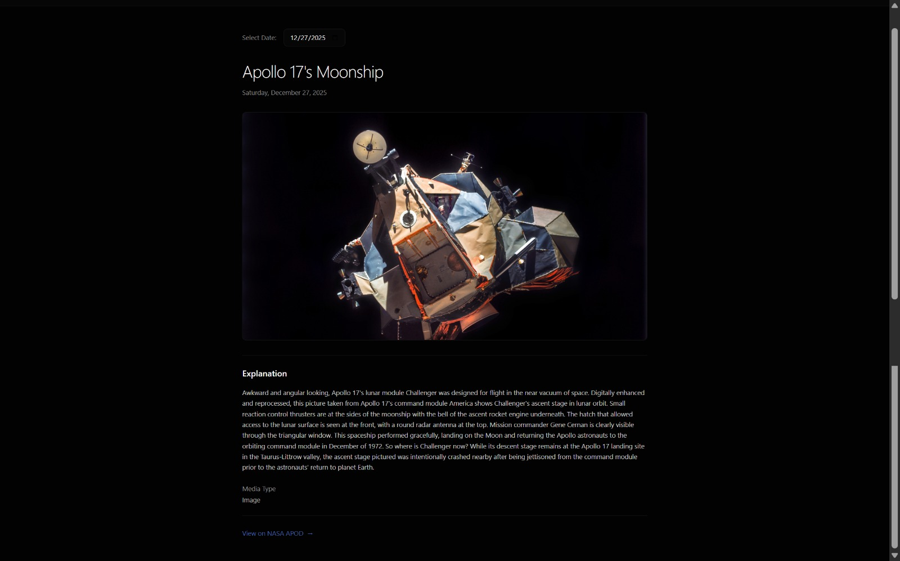
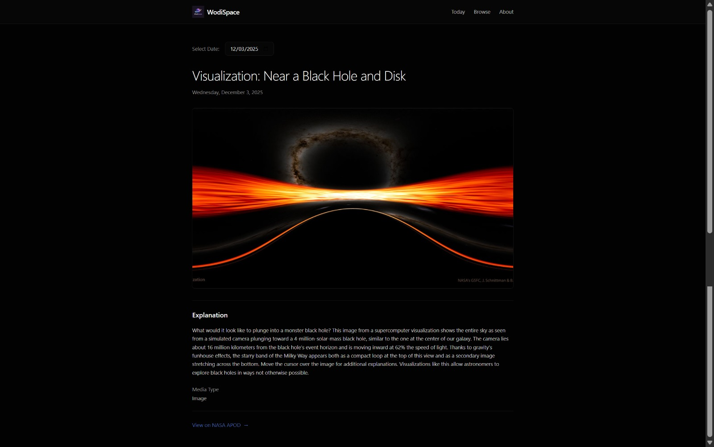

## WodiSpace

WodiSpace is a calm, minimal web app for exploring **NASA Astronomy Picture of the Day (APOD)**.

It presents NASA’s daily astronomical images with clarity, accuracy, and respect for the science behind them.





[Live App ↗](https://wodispace.vercel.app)

## What is APOD?

The **NASA Astronomy Picture of the Day** is a daily feature published by **NASA** since 1995.

Each day, NASA shares:

* one astronomical image or video
* a detailed explanation written by a professional astronomer
* scientific context about the universe

APOD covers galaxies, nebulae, planets, stars, and cosmic phenomena, ranging from events in our solar system to structures billions of light-years away.

## Why WodiSpace?

WodiSpace exists to present APOD **without distraction**.

Most interfaces add noise.
WodiSpace removes it.

The goal is simple:

* let the image speak
* let the explanation be readable
* let the science stay intact

## What WodiSpace does

* Displays today’s Astronomy Picture of the Day
* Supports browsing APOD by date
* Handles both image and video entries
* Preserves full attribution to NASA and original creators
* Uses a dark, calm interface suited for astronomical content

## What WodiSpace does *not* do

* It does not generate content
* It does not modify NASA’s explanations
* It does not use AI to rewrite or summarize
* It does not track users or add social features

WodiSpace is a viewer, not a generator.

## Data source and attribution

All data shown in WodiSpace comes directly from:

* **NASA**
* The official [APOD public API](https://github.com/nasa/apod-api)

WodiSpace maintains attribution to:

* NASA
* the original photographers and image creators

This project respects NASA’s data usage guidelines.


## Design philosophy

Every design choice in WodiSpace follows a few principles:

* **Clarity**
  Large typography and generous spacing improve readability.

* **Respect**
  The interface treats both the content and the viewer seriously.

* **Minimalism**
  No animations, gradients, or decorative effects.

* **Science-first**
  A dark theme that complements astronomical imagery instead of competing with it.

## Tech Stack

* Next.js
* TypeScript
* Tailwind CSS
* Server-side data fetching
* NASA APOD API

## Project Structure
```bash
WodiSpace/
├── app/                # App router pages and layouts
│   ├── about/          # About page
│   ├── browse/         # Date browsing feature
│   ├── api/            # Server routes (APOD fetching)
│   ├── globals.css     # Global styles
│   ├── layout.tsx      # Root layout
│   └── page.tsx        # Home page (today's APOD)
│
├── components/         # Reusable UI components
├── hooks/              # Custom React hooks
├── lib/                # Utilities and API helpers
├── public/             # Static assets
├── styles/             # Additional styling
├── assets/             # README screenshots
│
├── next.config.mjs     # Next.js configuration
├── postcss.config.mjs  # PostCSS config
├── tsconfig.json       # TypeScript config
├── package.json        # Dependencies and scripts
├── pnpm-lock.yaml      # Package lock file
├── components.json     # UI config
├── LICENSE
└── README.md
```

## License

[MIT License](LICENSE)

## Author

- **Caleb Wodi**
- [Twitter](https://x.com/calchiwo)
- [LinkedIn](https://www.linkedin.com/in/calchiwo)
